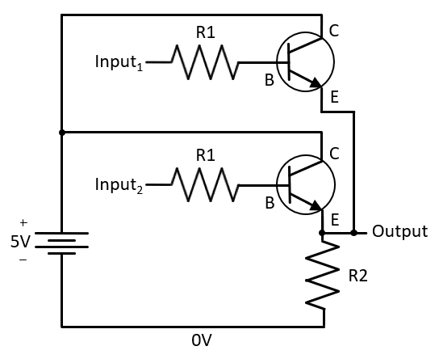

__Modern Computer Architecture and Organization__, by Jim Ledin. Published by Packt Publishing
# Chapter 2, Exercise 2

Create a circuit implementation of an OR gate by modifying the circuit of Figure 2.5. Wires, transistors, and resistors can be added as needed.

# Answer
The OR gate circuit is shown below:

