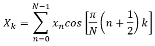

__Modern Computer Architecture and Organization__, by Jim Ledin. Published by Packt Publishing
# Chapter 6, Exercise 2
A common form of the one-dimensional discrete cosine transform is:

In this formula, <i>k</i>, the index of the DCT coefficient, runs from 0 to <i>N</i>-1.

Write a program to compute the DCT of the sequence <i>x</i>={0.5,0.2,0.7,-0.6,0.4-0.2,1.0,-0.3}.

Note that the cosine terms in the formula depend only on the indexes <i>n</i> and <i>k</i>, and do not depend on the input data sequence <i>x</i>. This means the cosine terms can be computed one time and stored as constants for later use. Using this approachas a preparatory step, the computation of each DCT coefficient reduces to a sequence of MAC operations.

Note also that this formula represents the un-optimized form of the DCT computation, requiring <i>N2</i> iterations of the MAC operation to compute all <i>N</i> DCT coefficients.

# Answer
