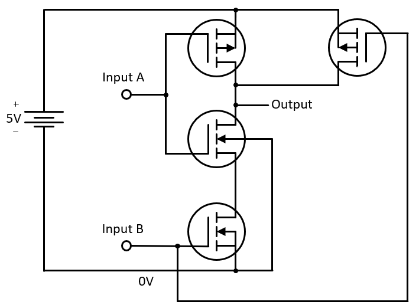

__Modern Computer Architecture and Organization__, by Jim Ledin. Published by Packt Publishing
# Chapter 4, Exercise 1

Create a circuit implementation of a NAND gate using two CMOS transistor pairs. Unlike  NPN transistor gate circuits, no resistors are required for this circuit.

# Answer
The diagram for this circuit is as follows:

