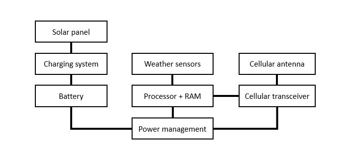

__Modern Computer Architecture and Organization__, by Jim Ledin. Published by Packt Publishing
# Chapter 13, Exercise 1

Draw a block diagram of the computing architecture for a system to measure and report weather data 24 hours a day at 5-minute intervals using SMS text messages. The system is battery powered and relies on solar cells to recharge the battery during daylight hours. Assume the weather instrumentation consumes minimal average power, only requiring full power momentarily during each measurement cycle.

# Answer
Based on the performance requirements, a processor capable of entering a very low power state for minutes at a time should be able to operate from a moderately sized battery for days at a time. By only powering weather sensors when needed to take a measurement, and only powering the cellular transceiver when it is time to transmit data, power usage is minimized.

The following diagram represents one possible configuration for this system:

